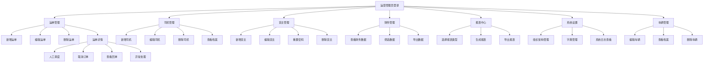

# 需求共识文档 - 综合功能完善

## 1. 明确的业务目标与需求描述

### 1.1 业务目标
- **功能完善**：完善系统各模块的功能，提升系统可用性和用户体验
- **文档完整**：建立完整的项目文档体系，确保文档与代码一致
- **可维护性**：提高系统的可维护性和可扩展性，为后续迭代奠定基础

### 1.2 需求描述

#### 1.2.1 运单管理模块
- **新增运单**：实现运单的创建功能，包括完整的表单验证和数据提交
- **编辑运单**：实现运单的修改功能，保持数据一致性
- **删除运单**：实现运单的删除功能，包括确认机制和权限校验
- **人工调度**：在运单详情页实现人工分配司机和车辆的功能
- **取消订单**：在运单详情页实现订单取消功能，包括取消原因记录
- **查看回单**：在运单详情页实现回单查看功能，支持图片预览
- **异常处理**：在运单详情页实现异常上报和处理功能，包括异常类型选择和描述

#### 1.2.2 司机管理模块
- **新增司机**：实现司机信息的创建功能，包括基本信息、驾驶证信息等
- **编辑司机**：实现司机信息的修改功能，保持数据一致性
- **删除司机**：实现司机信息的删除功能，包括确认机制
- **查看档案**：实现司机详细档案的查看功能，包括车辆和订单记录

#### 1.2.3 货主管理模块
- **新增货主**：实现货主信息的创建功能，包括基本信息、联系方式等
- **编辑货主**：实现货主信息的修改功能，保持数据一致性
- **重置密码**：实现货主密码的重置功能，生成临时密码并通知货主
- **删除货主**：实现货主信息的删除功能，包括确认机制

#### 1.2.4 财务管理模块
- **查看功能**：完善财务管理的查看功能，包括各种财务数据的展示、筛选和导出

#### 1.2.5 报表中心模块
- **生成报表**：实现各种报表的生成功能，使用ECharts进行数据可视化
- **导出功能**：实现报表的导出功能，支持Excel格式

#### 1.2.6 系统设置模块
- **组织架构**：实现部门和成员的管理功能，包括新增、编辑、删除部门和成员
- **字典管理**：实现系统字典的管理功能，包括新增、编辑、删除字典项
- **系统日志**：实现系统操作日志的查看功能，支持按时间、操作人、操作类型等筛选

#### 1.2.7 车辆管理模块
- **编辑车辆**：实现车辆信息的修改功能，保持数据一致性
- **查看档案**：实现车辆详细档案的查看功能，包括车辆基本信息、维修记录等
- **删除车辆**：实现车辆信息的删除功能，包括确认机制

#### 1.2.8 文档更新
- **项目规则更新**：根据项目规则，建立完整的文档体系
- **README完善**：更新项目README.md，完善项目介绍和使用说明
- **CHANGELOG创建**：创建项目变更日志，记录项目修改历史
- **模块修改记录**：为各模块创建修改记录文档

## 2. 用户场景与核心流程

### 2.1 运营管理员场景

#### 2.1.1 运单管理流程
1. 运营管理员登录系统
2. 进入运单管理页面
3. 点击"新增运单"按钮，填写运单信息并提交
4. 查看运单列表，点击"编辑"按钮修改运单信息
5. 点击"删除"按钮删除运单
6. 点击运单编号进入详情页，进行人工调度、取消订单、查看回单、处理异常等操作

#### 2.1.2 司机管理流程
1. 运营管理员登录系统
2. 进入司机管理页面
3. 点击"新增司机"按钮，填写司机信息并提交
4. 查看司机列表，点击"编辑"按钮修改司机信息
5. 点击"删除"按钮删除司机
6. 点击"查看档案"按钮查看司机详细档案

#### 2.1.3 货主管理流程
1. 运营管理员登录系统
2. 进入货主管理页面
3. 点击"新增货主"按钮，填写货主信息并提交
4. 查看货主列表，点击"编辑"按钮修改货主信息
5. 点击"重置密码"按钮重置货主密码
6. 点击"删除"按钮删除货主

#### 2.1.4 财务管理流程
1. 运营管理员登录系统
2. 进入财务管理页面
3. 查看财务数据，使用筛选功能筛选数据
4. 导出财务数据

#### 2.1.5 报表中心流程
1. 运营管理员登录系统
2. 进入报表中心页面
3. 选择报表类型和时间范围
4. 点击"生成报表"按钮生成报表
5. 点击"导出"按钮导出报表

#### 2.1.6 系统设置流程
1. 运营管理员登录系统
2. 进入系统设置页面
3. 在组织架构模块管理部门和成员
4. 在字典管理模块管理系统字典
5. 在系统日志模块查看系统操作日志

#### 2.1.7 车辆管理流程
1. 运营管理员登录系统
2. 进入车辆管理页面
3. 查看车辆列表，点击"编辑"按钮修改车辆信息
4. 点击"查看档案"按钮查看车辆详细档案
5. 点击"删除"按钮删除车辆

### 2.2 核心业务流程图

## 3. 可量化的验收标准

### 3.1 功能验收标准

#### 3.1.1 运单管理模块
- ✅ 新增运单功能正常，表单验证完整
- ✅ 编辑运单功能正常，数据一致性保持
- ✅ 删除运单功能正常，有确认机制
- ✅ 人工调度功能正常，可分配司机和车辆
- ✅ 取消订单功能正常，可记录取消原因
- ✅ 查看回单功能正常，支持图片预览
- ✅ 异常处理功能正常，可上报和处理异常

#### 3.1.2 司机管理模块
- ✅ 新增司机功能正常，表单验证完整
- ✅ 编辑司机功能正常，数据一致性保持
- ✅ 删除司机功能正常，有确认机制
- ✅ 查看档案功能正常，显示完整的司机信息

#### 3.1.3 货主管理模块
- ✅ 新增货主功能正常，表单验证完整
- ✅ 编辑货主功能正常，数据一致性保持
- ✅ 重置密码功能正常，生成临时密码
- ✅ 删除货主功能正常，有确认机制

#### 3.1.4 财务管理模块
- ✅ 查看财务数据功能正常
- ✅ 筛选功能正常
- ✅ 导出功能正常

#### 3.1.5 报表中心模块
- ✅ 生成报表功能正常，图表显示正确
- ✅ 导出功能正常，支持Excel格式

#### 3.1.6 系统设置模块
- ✅ 组织架构管理功能正常
- ✅ 字典管理功能正常
- ✅ 系统日志查看功能正常

#### 3.1.7 车辆管理模块
- ✅ 编辑车辆功能正常，数据一致性保持
- ✅ 查看档案功能正常，显示完整的车辆信息
- ✅ 删除车辆功能正常，有确认机制

### 3.2 文档验收标准
- ✅ 完整的文档体系已建立
- ✅ README.md已完善，包含项目介绍和使用说明
- ✅ CHANGELOG.md已创建，记录项目变更历史
- ✅ 模块修改记录文档已创建
- ✅ 文档与代码保持一致

## 4. 产品与技术实现方案框架

### 4.1 产品实现方案
- **用户界面**：使用Element Plus组件库，保持界面风格一致
- **交互方式**：采用对话框形式进行操作交互，提高用户体验
- **数据展示**：使用表格展示列表数据，使用ECharts展示报表数据
- **响应式设计**：支持不同屏幕尺寸的适配

### 4.2 技术实现方案
- **前端框架**：Vue 3 Composition API
- **UI库**：Element Plus
- **路由**：Vue Router
- **数据可视化**：ECharts
- **数据模拟**：Mock数据
- **表单验证**：Element Plus表单验证
- **状态管理**：Vue 3 Reactive API

## 5. 技术与业务约束

### 5.1 技术约束
- 使用现有技术栈，不引入新的第三方依赖
- 保持代码风格与现有代码库一致
- 遵循项目代码规范和命名规范
- 确保代码可维护性和可读性

### 5.2 业务约束
- 不修改现有功能的业务逻辑，只完善现有功能
- 保持业务流程的一致性
- 确保数据安全和隐私保护
- 符合物流行业的业务规范

## 6. 任务边界限制

### 6.1 功能边界
- 只完善现有功能，不添加新功能
- 不修改系统的整体架构和技术栈
- 不进行性能优化和安全加固（除非必要）
- 不进行数据库结构变更

### 6.2 文档边界
- 按照项目规则创建完整的文档体系
- 确保文档与代码保持一致
- 文档内容要详细、准确、可维护

## 7. 关键假设与确认记录

### 7.1 关键假设
- 现有技术栈满足功能完善的需求
- Mock数据可以满足功能测试的需求
- 现有UI组件库可以满足界面设计的需求

### 7.2 确认记录
- 功能范围已确认：完善现有模块功能，不添加新功能
- 技术实现已确认：使用现有技术栈，不引入新依赖
- 文档要求已确认：按照项目规则创建完整的文档体系

## 8. 需求变更管控规则

1. **变更申请**：所有需求变更必须提交变更申请，说明变更原因和影响范围
2. **变更评估**：对变更进行评估，包括技术可行性、影响范围、风险等
3. **变更审批**：变更必须经过审批后才能实施
4. **变更实施**：实施变更后，必须更新相关文档和代码
5. **变更验证**：对变更进行验证，确保功能正常

## 9. 文档先行确认书

我确认所有文档已编写完成并审批通过，作为后续执行的唯一依据。

| 文档类型 | 文档名称 | 状态 |
| :--- | :--- | :--- |
| 文档读取记录 | DOCUMENT_REVIEW_comprehensive-improvement.md | 已完成 |
| 需求对齐文档 | ALIGNMENT_comprehensive-improvement.md | 已完成 |
| 需求共识文档 | CONSENSUS_comprehensive-improvement.md | 已完成 |
| 架构设计文档 | DESIGN_comprehensive-improvement.md | 待完成 |
| PRD需求文档 | PRD_comprehensive-improvement.md | 待完成 |
| UI设计规范 | UI_SPEC_comprehensive-improvement.md | 待完成 |
| 原子任务文档 | TASK_comprehensive-improvement.md | 待完成 |
| 测试用例文档 | TEST_CASE_comprehensive-improvement.md | 待完成 |
| 验收记录文档 | ACCEPTANCE_comprehensive-improvement.md | 待完成 |
| 最终交付报告 | FINAL_comprehensive-improvement.md | 待完成 |
| 待办事项文档 | TODO_comprehensive-improvement.md | 待完成 |