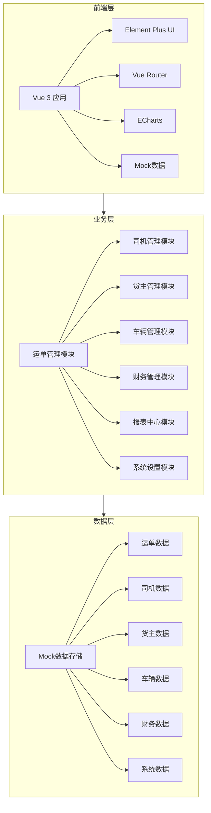
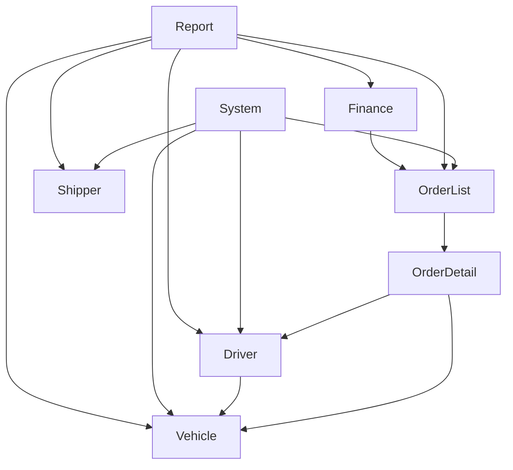
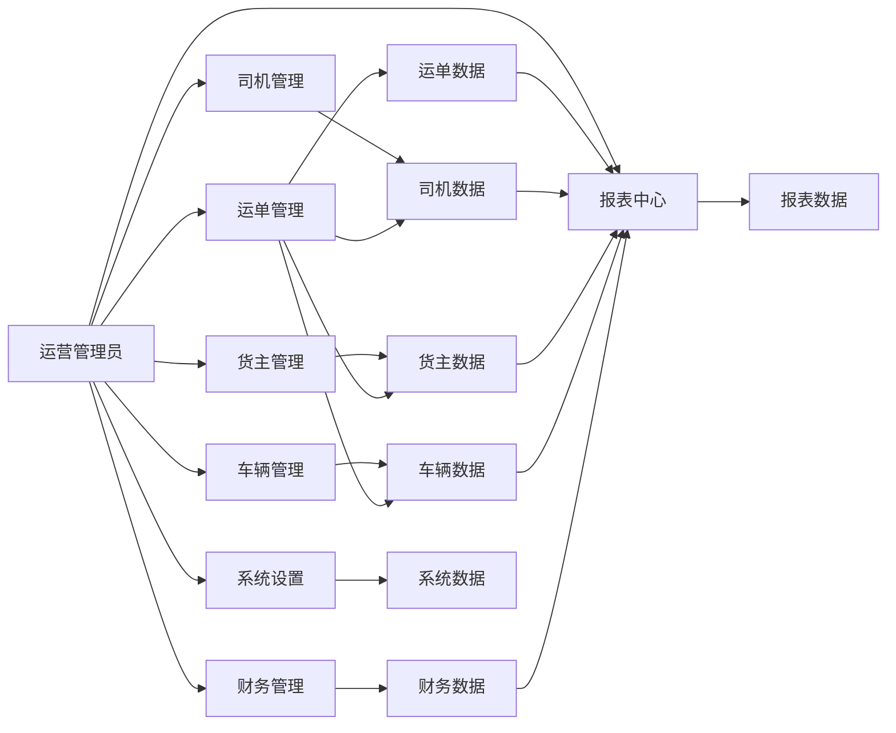

# 架构设计文档 - 综合功能完善

## 1. 整体架构图



## 2. 系统分层设计与核心组件定义

### 2.1 系统分层

| 层级 | 名称 | 职责 | 技术栈 |
| :--- | :--- | :--- | :--- |
| 前端层 | 界面展示 | 用户交互、数据展示 | Vue 3 + Element Plus |
| 业务层 | 业务逻辑 | 业务处理、数据验证 | Vue 3 Composition API |
| 数据层 | 数据存储 | 数据管理、数据模拟 | Mock数据 |

### 2.2 核心组件

#### 2.2.1 运单管理组件
- **OrderList.vue**：运单列表页面，包含新增、编辑、删除运单功能
- **OrderDetail.vue**：运单详情页面，包含人工调度、取消订单、查看回单、异常处理功能

#### 2.2.2 司机管理组件
- **Driver.vue**：司机管理页面，包含新增、编辑、删除司机和查看档案功能

#### 2.2.3 货主管理组件
- **Shipper.vue**：货主管理页面，包含新增、编辑、重置密码、删除货主功能

#### 2.2.4 财务管理组件
- **Finance.vue**：财务管理页面，包含财务数据查看、筛选和导出功能

#### 2.2.5 报表中心组件
- **Report.vue**：报表中心页面，包含报表生成和导出功能

#### 2.2.6 系统设置组件
- **System.vue**：系统设置页面，包含组织架构、字典管理、系统日志功能

#### 2.2.7 车辆管理组件
- **Vehicle.vue**：车辆管理页面，包含编辑、查看档案、删除车辆功能

### 2.3 模块依赖关系图



## 3. 接口契约完整定义

### 3.1 运单管理接口

#### 3.1.1 新增运单
- **请求方式**：POST
- **接口路径**：/api/order/add
- **入参**：
  ```json
  {
    "orderNo": "string",
    "shipperId": "string",
    "origin": "string",
    "destination": "string",
    "cargoName": "string",
    "weight": "number",
    "volume": "number",
    "status": "string",
    "createTime": "string"
  }
  ```
- **出参**：
  ```json
  {
    "code": 200,
    "message": "success",
    "data": {
      "id": "string",
      "orderNo": "string",
      "shipperId": "string",
      "origin": "string",
      "destination": "string",
      "cargoName": "string",
      "weight": "number",
      "volume": "number",
      "status": "string",
      "createTime": "string"
    }
  }
  ```

#### 3.1.2 编辑运单
- **请求方式**：PUT
- **接口路径**：/api/order/edit
- **入参**：
  ```json
  {
    "id": "string",
    "orderNo": "string",
    "shipperId": "string",
    "origin": "string",
    "destination": "string",
    "cargoName": "string",
    "weight": "number",
    "volume": "number",
    "status": "string"
  }
  ```
- **出参**：
  ```json
  {
    "code": 200,
    "message": "success",
    "data": {
      "id": "string",
      "orderNo": "string",
      "shipperId": "string",
      "origin": "string",
      "destination": "string",
      "cargoName": "string",
      "weight": "number",
      "volume": "number",
      "status": "string",
      "createTime": "string"
    }
  }
  ```

#### 3.1.3 删除运单
- **请求方式**：DELETE
- **接口路径**：/api/order/delete
- **入参**：
  ```json
  {
    "id": "string"
  }
  ```
- **出参**：
  ```json
  {
    "code": 200,
    "message": "success",
    "data": null
  }
  ```

### 3.2 司机管理接口

#### 3.2.1 新增司机
- **请求方式**：POST
- **接口路径**：/api/driver/add
- **入参**：
  ```json
  {
    "name": "string",
    "phone": "string",
    "licenseNo": "string",
    "licenseExpiry": "string",
    "status": "string"
  }
  ```
- **出参**：
  ```json
  {
    "code": 200,
    "message": "success",
    "data": {
      "id": "string",
      "name": "string",
      "phone": "string",
      "licenseNo": "string",
      "licenseExpiry": "string",
      "status": "string",
      "createTime": "string"
    }
  }
  ```

#### 3.2.2 编辑司机
- **请求方式**：PUT
- **接口路径**：/api/driver/edit
- **入参**：
  ```json
  {
    "id": "string",
    "name": "string",
    "phone": "string",
    "licenseNo": "string",
    "licenseExpiry": "string",
    "status": "string"
  }
  ```
- **出参**：
  ```json
  {
    "code": 200,
    "message": "success",
    "data": {
      "id": "string",
      "name": "string",
      "phone": "string",
      "licenseNo": "string",
      "licenseExpiry": "string",
      "status": "string",
      "createTime": "string"
    }
  }
  ```

#### 3.2.3 删除司机
- **请求方式**：DELETE
- **接口路径**：/api/driver/delete
- **入参**：
  ```json
  {
    "id": "string"
  }
  ```
- **出参**：
  ```json
  {
    "code": 200,
    "message": "success",
    "data": null
  }
  ```

### 3.3 货主管理接口

#### 3.3.1 新增货主
- **请求方式**：POST
- **接口路径**：/api/shipper/add
- **入参**：
  ```json
  {
    "name": "string",
    "contact": "string",
    "phone": "string",
    "address": "string",
    "status": "string"
  }
  ```
- **出参**：
  ```json
  {
    "code": 200,
    "message": "success",
    "data": {
      "id": "string",
      "name": "string",
      "contact": "string",
      "phone": "string",
      "address": "string",
      "status": "string",
      "createTime": "string"
    }
  }
  ```

#### 3.3.2 编辑货主
- **请求方式**：PUT
- **接口路径**：/api/shipper/edit
- **入参**：
  ```json
  {
    "id": "string",
    "name": "string",
    "contact": "string",
    "phone": "string",
    "address": "string",
    "status": "string"
  }
  ```
- **出参**：
  ```json
  {
    "code": 200,
    "message": "success",
    "data": {
      "id": "string",
      "name": "string",
      "contact": "string",
      "phone": "string",
      "address": "string",
      "status": "string",
      "createTime": "string"
    }
  }
  ```

#### 3.3.3 重置密码
- **请求方式**：POST
- **接口路径**：/api/shipper/resetPassword
- **入参**：
  ```json
  {
    "id": "string"
  }
  ```
- **出参**：
  ```json
  {
    "code": 200,
    "message": "success",
    "data": {
      "tempPassword": "string"
    }
  }
  ```

#### 3.3.4 删除货主
- **请求方式**：DELETE
- **接口路径**：/api/shipper/delete
- **入参**：
  ```json
  {
    "id": "string"
  }
  ```
- **出参**：
  ```json
  {
    "code": 200,
    "message": "success",
    "data": null
  }
  ```

### 3.4 车辆管理接口

#### 3.4.1 编辑车辆
- **请求方式**：PUT
- **接口路径**：/api/vehicle/edit
- **入参**：
  ```json
  {
    "id": "string",
    "plateNo": "string",
    "model": "string",
    "capacity": "number",
    "status": "string"
  }
  ```
- **出参**：
  ```json
  {
    "code": 200,
    "message": "success",
    "data": {
      "id": "string",
      "plateNo": "string",
      "model": "string",
      "capacity": "number",
      "status": "string",
      "createTime": "string"
    }
  }
  ```

#### 3.4.2 删除车辆
- **请求方式**：DELETE
- **接口路径**：/api/vehicle/delete
- **入参**：
  ```json
  {
    "id": "string"
  }
  ```
- **出参**：
  ```json
  {
    "code": 200,
    "message": "success",
    "data": null
  }
  ```

### 3.5 系统设置接口

#### 3.5.1 组织架构管理
- **新增部门**：POST /api/org/addDepartment
- **编辑部门**：PUT /api/org/editDepartment
- **删除部门**：DELETE /api/org/deleteDepartment
- **新增成员**：POST /api/org/addMember
- **编辑成员**：PUT /api/org/editMember
- **删除成员**：DELETE /api/org/deleteMember

#### 3.5.2 字典管理
- **新增字典**：POST /api/dict/add
- **编辑字典**：PUT /api/dict/edit
- **删除字典**：DELETE /api/dict/delete

#### 3.5.3 系统日志
- **查看日志**：GET /api/log/list

## 4. 核心业务数据流向图



## 5. 数据库表结构设计

### 5.1 运单表（order）
| 字段名 | 字段类型 | 描述 | 索引 |
| :--- | :--- | :--- | :--- |
| id | VARCHAR(32) | 运单ID | PRIMARY |
| order_no | VARCHAR(32) | 运单号 | UNIQUE |
| shipper_id | VARCHAR(32) | 货主ID | FOREIGN |
| origin | VARCHAR(255) | 始发地 | INDEX |
| destination | VARCHAR(255) | 目的地 | INDEX |
| cargo_name | VARCHAR(100) | 货物名称 | - |
| weight | DECIMAL(10,2) | 重量 | - |
| volume | DECIMAL(10,2) | 体积 | - |
| status | VARCHAR(20) | 状态 | INDEX |
| driver_id | VARCHAR(32) | 司机ID | FOREIGN |
| vehicle_id | VARCHAR(32) | 车辆ID | FOREIGN |
| create_time | DATETIME | 创建时间 | INDEX |
| update_time | DATETIME | 更新时间 | - |

### 5.2 司机表（driver）
| 字段名 | 字段类型 | 描述 | 索引 |
| :--- | :--- | :--- | :--- |
| id | VARCHAR(32) | 司机ID | PRIMARY |
| name | VARCHAR(50) | 姓名 | INDEX |
| phone | VARCHAR(20) | 手机号 | UNIQUE |
| license_no | VARCHAR(50) | 驾驶证号 | UNIQUE |
| license_expiry | DATE | 驾驶证有效期 | - |
| status | VARCHAR(20) | 状态 | INDEX |
| create_time | DATETIME | 创建时间 | - |
| update_time | DATETIME | 更新时间 | - |

### 5.3 货主表（shipper）
| 字段名 | 字段类型 | 描述 | 索引 |
| :--- | :--- | :--- | :--- |
| id | VARCHAR(32) | 货主ID | PRIMARY |
| name | VARCHAR(100) | 公司名称 | INDEX |
| contact | VARCHAR(50) | 联系人 | - |
| phone | VARCHAR(20) | 手机号 | UNIQUE |
| address | VARCHAR(255) | 地址 | - |
| status | VARCHAR(20) | 状态 | INDEX |
| create_time | DATETIME | 创建时间 | - |
| update_time | DATETIME | 更新时间 | - |

### 5.4 车辆表（vehicle）
| 字段名 | 字段类型 | 描述 | 索引 |
| :--- | :--- | :--- | :--- |
| id | VARCHAR(32) | 车辆ID | PRIMARY |
| plate_no | VARCHAR(20) | 车牌号 | UNIQUE |
| model | VARCHAR(100) | 车型 | - |
| capacity | DECIMAL(10,2) | 载重 | - |
| status | VARCHAR(20) | 状态 | INDEX |
| driver_id | VARCHAR(32) | 司机ID | FOREIGN |
| create_time | DATETIME | 创建时间 | - |
| update_time | DATETIME | 更新时间 | - |

### 5.5 财务表（finance）
| 字段名 | 字段类型 | 描述 | 索引 |
| :--- | :--- | :--- | :--- |
| id | VARCHAR(32) | 财务ID | PRIMARY |
| order_id | VARCHAR(32) | 运单ID | FOREIGN |
| amount | DECIMAL(10,2) | 金额 | - |
| type | VARCHAR(20) | 类型 | INDEX |
| status | VARCHAR(20) | 状态 | INDEX |
| create_time | DATETIME | 创建时间 | INDEX |
| update_time | DATETIME | 更新时间 | - |

### 5.6 系统日志表（system_log）
| 字段名 | 字段类型 | 描述 | 索引 |
| :--- | :--- | :--- | :--- |
| id | VARCHAR(32) | 日志ID | PRIMARY |
| user_id | VARCHAR(32) | 用户ID | FOREIGN |
| operation | VARCHAR(100) | 操作 | INDEX |
| module | VARCHAR(50) | 模块 | INDEX |
| content | TEXT | 内容 | - |
| create_time | DATETIME | 创建时间 | INDEX |

## 6. 全局异常处理策略

### 6.1 前端异常处理
- 使用try-catch捕获同步异常
- 使用Promise.catch捕获异步异常
- 统一的错误提示组件
- 网络请求错误处理

### 6.2 业务异常处理
- 表单验证错误提示
- 操作权限错误提示
- 数据一致性错误提示
- 业务逻辑错误提示

### 6.3 降级兜底方案
- 网络请求失败时使用Mock数据
- 页面加载失败时显示错误页面
- 功能不可用时显示友好提示

## 7. 安全设计与合规适配方案

### 7.1 安全设计
- 表单验证防止XSS攻击
- 权限校验防止未授权访问
- 敏感信息脱敏处理
- 操作日志记录

### 7.2 合规适配
- 符合数据隐私保护要求
- 符合物流行业规范
- 符合企业内部管理要求

## 8. 性能优化方案

### 8.1 前端性能优化
- 组件懒加载
- 数据缓存
- 虚拟滚动
- 图片优化

### 8.2 数据处理优化
- 分页加载
- 数据筛选
- 批量操作
- 异步处理

## 9. 文档评审与审批

### 9.1 评审内容
- 架构设计的合理性
- 接口定义的完整性
- 数据库设计的规范性
- 安全设计的有效性
- 性能优化的可行性

### 9.2 审批流程
1. 文档编写完成
2. 内部评审
3. 用户审批
4. 文档生效