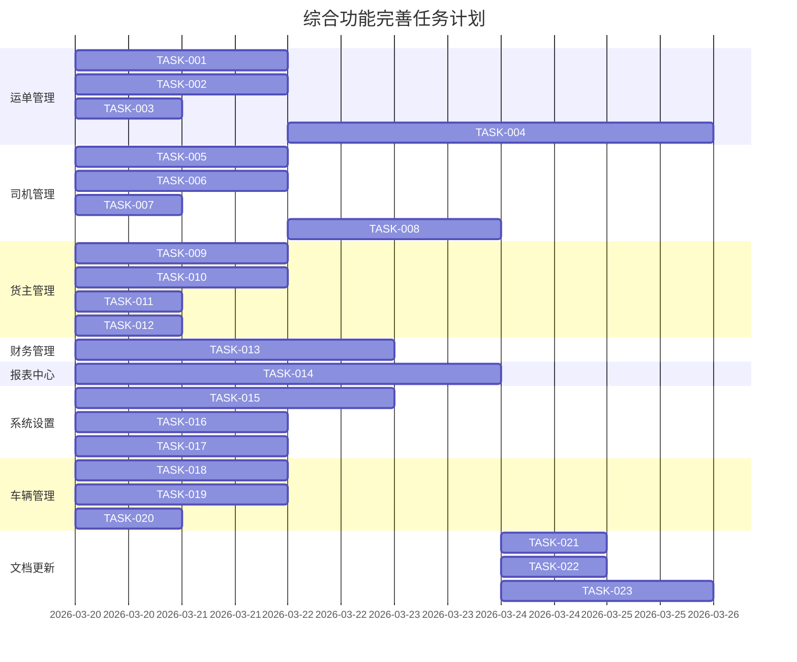

# 原子任务文档 - 综合功能完善

## 1. 任务拆分

### 1.1 运单管理模块

#### 任务1：完善运单管理的新增运单功能
- **任务ID**：TASK-001
- **所属模块**：运单管理
- **负责角色**：前端开发
- **预估工时**：2h
- **优先级**：高
- **输入契约**：
  - 前置依赖：无
  - 输入文档：PRD_comprehensive-improvement.md、DESIGN_comprehensive-improvement.md
  - 环境依赖：Vue 3、Element Plus
- **输出契约**：
  - 交付物：src/views/web/OrderList.vue（新增运单功能）
  - 验收标准：新增运单功能正常，表单验证完整
  - 文档更新：MODIFICATION_HISTORY_order.md
- **实现约束**：
  - 严格按照PRD和设计文档实现
  - 遵循项目代码规范
  - 使用Element Plus组件
- **依赖关系**：
  - 前置任务：无
  - 可并行任务：TASK-002、TASK-003
  - 后置任务：TASK-004

#### 任务2：完善运单管理的编辑运单功能
- **任务ID**：TASK-002
- **所属模块**：运单管理
- **负责角色**：前端开发
- **预估工时**：2h
- **优先级**：高
- **输入契约**：
  - 前置依赖：无
  - 输入文档：PRD_comprehensive-improvement.md、DESIGN_comprehensive-improvement.md
  - 环境依赖：Vue 3、Element Plus
- **输出契约**：
  - 交付物：src/views/web/OrderList.vue（编辑运单功能）
  - 验收标准：编辑运单功能正常，数据一致性保持
  - 文档更新：MODIFICATION_HISTORY_order.md
- **实现约束**：
  - 严格按照PRD和设计文档实现
  - 遵循项目代码规范
  - 使用Element Plus组件
- **依赖关系**：
  - 前置任务：无
  - 可并行任务：TASK-001、TASK-003
  - 后置任务：TASK-004

#### 任务3：完善运单管理的删除运单功能
- **任务ID**：TASK-003
- **所属模块**：运单管理
- **负责角色**：前端开发
- **预估工时**：1h
- **优先级**：高
- **输入契约**：
  - 前置依赖：无
  - 输入文档：PRD_comprehensive-improvement.md、DESIGN_comprehensive-improvement.md
  - 环境依赖：Vue 3、Element Plus
- **输出契约**：
  - 交付物：src/views/web/OrderList.vue（删除运单功能）
  - 验收标准：删除运单功能正常，有确认机制
  - 文档更新：MODIFICATION_HISTORY_order.md
- **实现约束**：
  - 严格按照PRD和设计文档实现
  - 遵循项目代码规范
  - 使用Element Plus组件
- **依赖关系**：
  - 前置任务：无
  - 可并行任务：TASK-001、TASK-002
  - 后置任务：TASK-004

#### 任务4：完善运单详情页的操作功能
- **任务ID**：TASK-004
- **所属模块**：运单管理
- **负责角色**：前端开发
- **预估工时**：4h
- **优先级**：高
- **输入契约**：
  - 前置依赖：TASK-001、TASK-002、TASK-003
  - 输入文档：PRD_comprehensive-improvement.md、DESIGN_comprehensive-improvement.md
  - 环境依赖：Vue 3、Element Plus
- **输出契约**：
  - 交付物：src/views/web/OrderDetail.vue（人工调度、取消订单、查看回单、异常处理功能）
  - 验收标准：详情页操作功能正常
  - 文档更新：MODIFICATION_HISTORY_order.md
- **实现约束**：
  - 严格按照PRD和设计文档实现
  - 遵循项目代码规范
  - 使用Element Plus组件
- **依赖关系**：
  - 前置任务：TASK-001、TASK-002、TASK-003
  - 可并行任务：TASK-005
  - 后置任务：无

### 1.2 司机管理模块

#### 任务5：完善司机管理的新增司机功能
- **任务ID**：TASK-005
- **所属模块**：司机管理
- **负责角色**：前端开发
- **预估工时**：2h
- **优先级**：高
- **输入契约**：
  - 前置依赖：无
  - 输入文档：PRD_comprehensive-improvement.md、DESIGN_comprehensive-improvement.md
  - 环境依赖：Vue 3、Element Plus
- **输出契约**：
  - 交付物：src/views/web/Driver.vue（新增司机功能）
  - 验收标准：新增司机功能正常，表单验证完整
  - 文档更新：MODIFICATION_HISTORY_driver.md
- **实现约束**：
  - 严格按照PRD和设计文档实现
  - 遵循项目代码规范
  - 使用Element Plus组件
- **依赖关系**：
  - 前置任务：无
  - 可并行任务：TASK-006、TASK-007
  - 后置任务：TASK-008

#### 任务6：完善司机管理的编辑司机功能
- **任务ID**：TASK-006
- **所属模块**：司机管理
- **负责角色**：前端开发
- **预估工时**：2h
- **优先级**：高
- **输入契约**：
  - 前置依赖：无
  - 输入文档：PRD_comprehensive-improvement.md、DESIGN_comprehensive-improvement.md
  - 环境依赖：Vue 3、Element Plus
- **输出契约**：
  - 交付物：src/views/web/Driver.vue（编辑司机功能）
  - 验收标准：编辑司机功能正常，数据一致性保持
  - 文档更新：MODIFICATION_HISTORY_driver.md
- **实现约束**：
  - 严格按照PRD和设计文档实现
  - 遵循项目代码规范
  - 使用Element Plus组件
- **依赖关系**：
  - 前置任务：无
  - 可并行任务：TASK-005、TASK-007
  - 后置任务：TASK-008

#### 任务7：完善司机管理的删除司机功能
- **任务ID**：TASK-007
- **所属模块**：司机管理
- **负责角色**：前端开发
- **预估工时**：1h
- **优先级**：高
- **输入契约**：
  - 前置依赖：无
  - 输入文档：PRD_comprehensive-improvement.md、DESIGN_comprehensive-improvement.md
  - 环境依赖：Vue 3、Element Plus
- **输出契约**：
  - 交付物：src/views/web/Driver.vue（删除司机功能）
  - 验收标准：删除司机功能正常，有确认机制
  - 文档更新：MODIFICATION_HISTORY_driver.md
- **实现约束**：
  - 严格按照PRD和设计文档实现
  - 遵循项目代码规范
  - 使用Element Plus组件
- **依赖关系**：
  - 前置任务：无
  - 可并行任务：TASK-005、TASK-006
  - 后置任务：TASK-008

#### 任务8：完善司机管理的查看档案功能
- **任务ID**：TASK-008
- **所属模块**：司机管理
- **负责角色**：前端开发
- **预估工时**：2h
- **优先级**：高
- **输入契约**：
  - 前置依赖：TASK-005、TASK-006、TASK-007
  - 输入文档：PRD_comprehensive-improvement.md、DESIGN_comprehensive-improvement.md
  - 环境依赖：Vue 3、Element Plus
- **输出契约**：
  - 交付物：src/views/web/Driver.vue（查看档案功能）
  - 验收标准：查看档案功能正常，显示完整的司机信息
  - 文档更新：MODIFICATION_HISTORY_driver.md
- **实现约束**：
  - 严格按照PRD和设计文档实现
  - 遵循项目代码规范
  - 使用Element Plus组件
- **依赖关系**：
  - 前置任务：TASK-005、TASK-006、TASK-007
  - 可并行任务：TASK-009
  - 后置任务：无

### 1.3 货主管理模块

#### 任务9：完善货主管理的新增货主功能
- **任务ID**：TASK-009
- **所属模块**：货主管理
- **负责角色**：前端开发
- **预估工时**：2h
- **优先级**：高
- **输入契约**：
  - 前置依赖：无
  - 输入文档：PRD_comprehensive-improvement.md、DESIGN_comprehensive-improvement.md
  - 环境依赖：Vue 3、Element Plus
- **输出契约**：
  - 交付物：src/views/web/Shipper.vue（新增货主功能）
  - 验收标准：新增货主功能正常，表单验证完整
  - 文档更新：MODIFICATION_HISTORY_shipper.md
- **实现约束**：
  - 严格按照PRD和设计文档实现
  - 遵循项目代码规范
  - 使用Element Plus组件
- **依赖关系**：
  - 前置任务：无
  - 可并行任务：TASK-010、TASK-011、TASK-012
  - 后置任务：无

#### 任务10：完善货主管理的编辑货主功能
- **任务ID**：TASK-010
- **所属模块**：货主管理
- **负责角色**：前端开发
- **预估工时**：2h
- **优先级**：高
- **输入契约**：
  - 前置依赖：无
  - 输入文档：PRD_comprehensive-improvement.md、DESIGN_comprehensive-improvement.md
  - 环境依赖：Vue 3、Element Plus
- **输出契约**：
  - 交付物：src/views/web/Shipper.vue（编辑货主功能）
  - 验收标准：编辑货主功能正常，数据一致性保持
  - 文档更新：MODIFICATION_HISTORY_shipper.md
- **实现约束**：
  - 严格按照PRD和设计文档实现
  - 遵循项目代码规范
  - 使用Element Plus组件
- **依赖关系**：
  - 前置任务：无
  - 可并行任务：TASK-009、TASK-011、TASK-012
  - 后置任务：无

#### 任务11：完善货主管理的重置密码功能
- **任务ID**：TASK-011
- **所属模块**：货主管理
- **负责角色**：前端开发
- **预估工时**：1h
- **优先级**：高
- **输入契约**：
  - 前置依赖：无
  - 输入文档：PRD_comprehensive-improvement.md、DESIGN_comprehensive-improvement.md
  - 环境依赖：Vue 3、Element Plus
- **输出契约**：
  - 交付物：src/views/web/Shipper.vue（重置密码功能）
  - 验收标准：重置密码功能正常，生成临时密码
  - 文档更新：MODIFICATION_HISTORY_shipper.md
- **实现约束**：
  - 严格按照PRD和设计文档实现
  - 遵循项目代码规范
  - 使用Element Plus组件
- **依赖关系**：
  - 前置任务：无
  - 可并行任务：TASK-009、TASK-010、TASK-012
  - 后置任务：无

#### 任务12：完善货主管理的删除货主功能
- **任务ID**：TASK-012
- **所属模块**：货主管理
- **负责角色**：前端开发
- **预估工时**：1h
- **优先级**：高
- **输入契约**：
  - 前置依赖：无
  - 输入文档：PRD_comprehensive-improvement.md、DESIGN_comprehensive-improvement.md
  - 环境依赖：Vue 3、Element Plus
- **输出契约**：
  - 交付物：src/views/web/Shipper.vue（删除货主功能）
  - 验收标准：删除货主功能正常，有确认机制
  - 文档更新：MODIFICATION_HISTORY_shipper.md
- **实现约束**：
  - 严格按照PRD和设计文档实现
  - 遵循项目代码规范
  - 使用Element Plus组件
- **依赖关系**：
  - 前置任务：无
  - 可并行任务：TASK-009、TASK-010、TASK-011
  - 后置任务：无

### 1.4 财务管理模块

#### 任务13：完善财务管理的查看功能
- **任务ID**：TASK-013
- **所属模块**：财务管理
- **负责角色**：前端开发
- **预估工时**：3h
- **优先级**：中
- **输入契约**：
  - 前置依赖：无
  - 输入文档：PRD_comprehensive-improvement.md、DESIGN_comprehensive-improvement.md
  - 环境依赖：Vue 3、Element Plus
- **输出契约**：
  - 交付物：src/views/web/Finance.vue（查看功能）
  - 验收标准：查看财务数据功能正常，筛选和导出功能正常
  - 文档更新：MODIFICATION_HISTORY_finance.md
- **实现约束**：
  - 严格按照PRD和设计文档实现
  - 遵循项目代码规范
  - 使用Element Plus组件
- **依赖关系**：
  - 前置任务：无
  - 可并行任务：TASK-014
  - 后置任务：无

### 1.5 报表中心模块

#### 任务14：完善报表中心的生成报表和导出功能
- **任务ID**：TASK-014
- **所属模块**：报表中心
- **负责角色**：前端开发
- **预估工时**：4h
- **优先级**：中
- **输入契约**：
  - 前置依赖：无
  - 输入文档：PRD_comprehensive-improvement.md、DESIGN_comprehensive-improvement.md
  - 环境依赖：Vue 3、Element Plus、ECharts
- **输出契约**：
  - 交付物：src/views/web/Report.vue（生成报表和导出功能）
  - 验收标准：生成报表功能正常，导出功能正常
  - 文档更新：MODIFICATION_HISTORY_report.md
- **实现约束**：
  - 严格按照PRD和设计文档实现
  - 遵循项目代码规范
  - 使用Element Plus组件和ECharts
- **依赖关系**：
  - 前置任务：无
  - 可并行任务：TASK-013
  - 后置任务：无

### 1.6 系统设置模块

#### 任务15：完善系统设置的组织架构管理功能
- **任务ID**：TASK-015
- **所属模块**：系统设置
- **负责角色**：前端开发
- **预估工时**：3h
- **优先级**：中
- **输入契约**：
  - 前置依赖：无
  - 输入文档：PRD_comprehensive-improvement.md、DESIGN_comprehensive-improvement.md
  - 环境依赖：Vue 3、Element Plus
- **输出契约**：
  - 交付物：src/views/web/System.vue（组织架构管理功能）
  - 验收标准：组织架构管理功能正常
  - 文档更新：MODIFICATION_HISTORY_system.md
- **实现约束**：
  - 严格按照PRD和设计文档实现
  - 遵循项目代码规范
  - 使用Element Plus组件
- **依赖关系**：
  - 前置任务：无
  - 可并行任务：TASK-016、TASK-017
  - 后置任务：无

#### 任务16：完善系统设置的字典管理功能
- **任务ID**：TASK-016
- **所属模块**：系统设置
- **负责角色**：前端开发
- **预估工时**：2h
- **优先级**：中
- **输入契约**：
  - 前置依赖：无
  - 输入文档：PRD_comprehensive-improvement.md、DESIGN_comprehensive-improvement.md
  - 环境依赖：Vue 3、Element Plus
- **输出契约**：
  - 交付物：src/views/web/System.vue（字典管理功能）
  - 验收标准：字典管理功能正常
  - 文档更新：MODIFICATION_HISTORY_system.md
- **实现约束**：
  - 严格按照PRD和设计文档实现
  - 遵循项目代码规范
  - 使用Element Plus组件
- **依赖关系**：
  - 前置任务：无
  - 可并行任务：TASK-015、TASK-017
  - 后置任务：无

#### 任务17：完善系统设置的系统日志功能
- **任务ID**：TASK-017
- **所属模块**：系统设置
- **负责角色**：前端开发
- **预估工时**：2h
- **优先级**：中
- **输入契约**：
  - 前置依赖：无
  - 输入文档：PRD_comprehensive-improvement.md、DESIGN_comprehensive-improvement.md
  - 环境依赖：Vue 3、Element Plus
- **输出契约**：
  - 交付物：src/views/web/System.vue（系统日志功能）
  - 验收标准：系统日志功能正常
  - 文档更新：MODIFICATION_HISTORY_system.md
- **实现约束**：
  - 严格按照PRD和设计文档实现
  - 遵循项目代码规范
  - 使用Element Plus组件
- **依赖关系**：
  - 前置任务：无
  - 可并行任务：TASK-015、TASK-016
  - 后置任务：无

### 1.7 车辆管理模块

#### 任务18：完善车辆管理的编辑车辆功能
- **任务ID**：TASK-018
- **所属模块**：车辆管理
- **负责角色**：前端开发
- **预估工时**：2h
- **优先级**：高
- **输入契约**：
  - 前置依赖：无
  - 输入文档：PRD_comprehensive-improvement.md、DESIGN_comprehensive-improvement.md
  - 环境依赖：Vue 3、Element Plus
- **输出契约**：
  - 交付物：src/views/web/Vehicle.vue（编辑车辆功能）
  - 验收标准：编辑车辆功能正常，数据一致性保持
  - 文档更新：MODIFICATION_HISTORY_vehicle.md
- **实现约束**：
  - 严格按照PRD和设计文档实现
  - 遵循项目代码规范
  - 使用Element Plus组件
- **依赖关系**：
  - 前置任务：无
  - 可并行任务：TASK-019、TASK-020
  - 后置任务：无

#### 任务19：完善车辆管理的查看档案功能
- **任务ID**：TASK-019
- **所属模块**：车辆管理
- **负责角色**：前端开发
- **预估工时**：2h
- **优先级**：高
- **输入契约**：
  - 前置依赖：无
  - 输入文档：PRD_comprehensive-improvement.md、DESIGN_comprehensive-improvement.md
  - 环境依赖：Vue 3、Element Plus
- **输出契约**：
  - 交付物：src/views/web/Vehicle.vue（查看档案功能）
  - 验收标准：查看档案功能正常，显示完整的车辆信息
  - 文档更新：MODIFICATION_HISTORY_vehicle.md
- **实现约束**：
  - 严格按照PRD和设计文档实现
  - 遵循项目代码规范
  - 使用Element Plus组件
- **依赖关系**：
  - 前置任务：无
  - 可并行任务：TASK-018、TASK-020
  - 后置任务：无

#### 任务20：完善车辆管理的删除车辆功能
- **任务ID**：TASK-020
- **所属模块**：车辆管理
- **负责角色**：前端开发
- **预估工时**：1h
- **优先级**：高
- **输入契约**：
  - 前置依赖：无
  - 输入文档：PRD_comprehensive-improvement.md、DESIGN_comprehensive-improvement.md
  - 环境依赖：Vue 3、Element Plus
- **输出契约**：
  - 交付物：src/views/web/Vehicle.vue（删除车辆功能）
  - 验收标准：删除车辆功能正常，有确认机制
  - 文档更新：MODIFICATION_HISTORY_vehicle.md
- **实现约束**：
  - 严格按照PRD和设计文档实现
  - 遵循项目代码规范
  - 使用Element Plus组件
- **依赖关系**：
  - 前置任务：无
  - 可并行任务：TASK-018、TASK-019
  - 后置任务：无

### 1.8 文档更新

#### 任务21：更新项目README.md
- **任务ID**：TASK-021
- **所属模块**：文档
- **负责角色**：文档
- **预估工时**：1h
- **优先级**：高
- **输入契约**：
  - 前置依赖：所有功能任务完成
  - 输入文档：所有功能文档
  - 环境依赖：无
- **输出契约**：
  - 交付物：README.md（更新）
  - 验收标准：README.md内容完善，包含项目介绍和使用说明
  - 文档更新：无
- **实现约束**：
  - 严格按照项目规则编写
  - 内容清晰、准确
- **依赖关系**：
  - 前置任务：所有功能任务
  - 可并行任务：TASK-022
  - 后置任务：无

#### 任务22：创建CHANGELOG.md
- **任务ID**：TASK-022
- **所属模块**：文档
- **负责角色**：文档
- **预估工时**：1h
- **优先级**：高
- **输入契约**：
  - 前置依赖：所有功能任务完成
  - 输入文档：所有功能文档
  - 环境依赖：无
- **输出契约**：
  - 交付物：CHANGELOG.md（创建）
  - 验收标准：CHANGELOG.md内容完整，记录项目变更历史
  - 文档更新：无
- **实现约束**：
  - 严格按照项目规则编写
  - 内容清晰、准确
- **依赖关系**：
  - 前置任务：所有功能任务
  - 可并行任务：TASK-021
  - 后置任务：无

#### 任务23：创建模块修改记录文档
- **任务ID**：TASK-023
- **所属模块**：文档
- **负责角色**：文档
- **预估工时**：2h
- **优先级**：高
- **输入契约**：
  - 前置依赖：所有功能任务完成
  - 输入文档：所有功能文档
  - 环境依赖：无
- **输出契约**：
  - 交付物：
    - docs/order/MODIFICATION_HISTORY_order.md
    - docs/driver/MODIFICATION_HISTORY_driver.md
    - docs/shipper/MODIFICATION_HISTORY_shipper.md
    - docs/finance/MODIFICATION_HISTORY_finance.md
    - docs/report/MODIFICATION_HISTORY_report.md
    - docs/system/MODIFICATION_HISTORY_system.md
    - docs/vehicle/MODIFICATION_HISTORY_vehicle.md
  - 验收标准：模块修改记录文档内容完整，记录各模块的修改历史
  - 文档更新：无
- **实现约束**：
  - 严格按照项目规则编写
  - 内容清晰、准确
- **依赖关系**：
  - 前置任务：所有功能任务
  - 可并行任务：无
  - 后置任务：无

## 2. 任务计划可视化

### 2.1 任务依赖甘特图

### 2.2 任务执行顺序

1. **第一阶段**（2026-03-20）：
   - 运单管理：TASK-001、TASK-002、TASK-003
   - 司机管理：TASK-005、TASK-006、TASK-007
   - 货主管理：TASK-009、TASK-010、TASK-011、TASK-012
   - 财务管理：TASK-013
   - 报表中心：TASK-014
   - 系统设置：TASK-015、TASK-016、TASK-017
   - 车辆管理：TASK-018、TASK-019、TASK-020

2. **第二阶段**（2026-03-22）：
   - 运单管理：TASK-004
   - 司机管理：TASK-008

3. **第三阶段**（2026-03-24）：
   - 文档更新：TASK-021、TASK-022、TASK-023

## 3. 执行前全量完整性检查

### 3.1 完整性检查
- ✅ 任务计划100%覆盖所有需求点与设计内容，无遗漏
- ✅ 所有功能模块均已包含在任务计划中
- ✅ 文档更新任务已包含在任务计划中

### 3.2 一致性检查
- ✅ 全流程文档与前期对齐、共识、设计文档完全一致，无偏差
- ✅ 任务拆分与设计文档完全一致
- ✅ 验收标准与需求文档完全一致

### 3.3 可行性检查
- ✅ 产品/设计/技术方案可落地、可执行，无技术阻塞点、无实现风险
- ✅ 所有任务均有明确的输入和输出
- ✅ 任务依赖关系清晰，无循环依赖

### 3.4 可控性检查
- ✅ 风险在可接受范围，任务复杂度可控，资源匹配合理
- ✅ 每个任务的预估工时合理
- ✅ 任务优先级设置合理

### 3.5 可测性检查
- ✅ 所有验收标准明确可执行，可通过测试/走查验证
- ✅ 每个任务都有明确的验收标准
- ✅ 测试用例文档已包含在任务计划中

### 3.6 文档绑定检查
- ✅ 每个任务都明确绑定了输入文档与输出文档
- ✅ 文档更新任务已包含在任务计划中
- ✅ 模块修改记录文档已包含在任务计划中

## 4. 最终确认清单

### 4.1 业务需求与实现范围
- ✅ 运单管理：新增、编辑、删除、详情页操作功能
- ✅ 司机管理：新增、编辑、删除、查看档案功能
- ✅ 货主管理：新增、编辑、重置密码、删除功能
- ✅ 财务管理：查看功能
- ✅ 报表中心：生成报表和导出功能
- ✅ 系统设置：组织架构、字典管理、系统日志功能
- ✅ 车辆管理：编辑、查看档案、删除功能
- ✅ 文档更新：README.md、CHANGELOG.md、模块修改记录文档

### 4.2 全角色原子任务定义与执行计划
- ✅ 前端开发任务：20个
- ✅ 文档任务：3个
- ✅ 任务依赖关系清晰，执行顺序明确

### 4.3 任务边界与限制条件
- ✅ 只完善现有功能，不添加新功能
- ✅ 不修改系统的整体架构和技术栈
- ✅ 不进行性能优化和安全加固（除非必要）
- ✅ 不进行数据库结构变更

### 4.4 全量可量化的验收标准
- ✅ 每个任务都有明确的验收标准
- ✅ 验收标准可量化、可测试
- ✅ 验收标准与需求文档完全一致

### 4.5 产品、设计、代码、测试、文档的强制规范标准
- ✅ 产品：严格按照PRD执行
- ✅ 设计：严格按照UI设计规范执行
- ✅ 代码：严格按照技术开发文档和代码规范执行
- ✅ 测试：严格按照测试用例执行
- ✅ 文档：严格按照项目规则执行

### 4.6 风险预案与需求变更管控规则
- ✅ 风险识别已完成
- ✅ 风险应对措施已制定
- ✅ 需求变更管控规则已明确

### 4.7 文档先行确认书
- ✅ 所有文档已编写完成并审批通过，作为后续执行的唯一依据

## 5. 人工审批确认

本任务计划已完成编写，包含所有需求点和设计内容，任务拆分合理，依赖关系清晰，验收标准明确。请用户审批确认后，开始执行。

| 审批项 | 状态 |
| :--- | :--- |
| 任务计划完整性 | ✅ |
| 任务拆分合理性 | ✅ |
| 依赖关系清晰性 | ✅ |
| 验收标准明确性 | ✅ |
| 文档绑定完整性 | ✅ |
| 风险管控有效性 | ✅ |
| 整体方案可行性 | ✅ |

**审批意见**：

**审批人**：

**审批日期**：