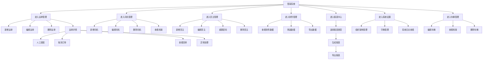
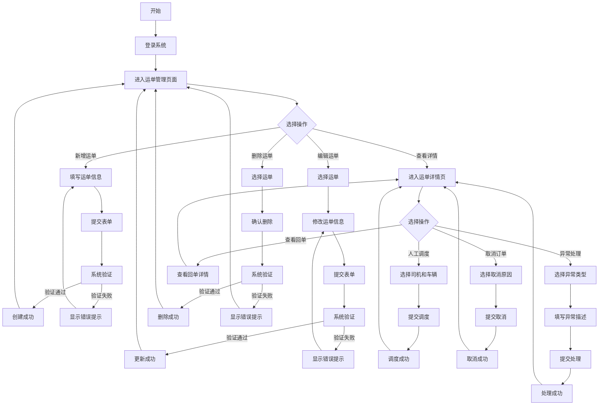
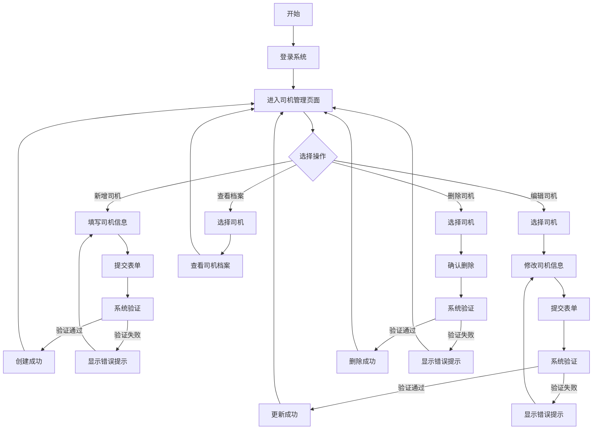

# 产品需求文档 - 综合功能完善

## 1. 需求概述

### 1.1 项目背景
- 大宗物流TMS管理系统是一个集运单管理、司机管理、货主管理、财务管理、报表中心、系统设置、车辆管理于一体的综合管理系统
- 现有系统已实现基础功能，但部分模块功能不完善，需要进行综合功能完善
- 同时需要建立完整的文档体系，确保系统可维护性和可扩展性

### 1.2 需求目标
- 完善系统各模块功能，提升系统可用性和用户体验
- 建立完整的项目文档体系，确保文档与代码一致
- 提高系统的可维护性和可扩展性，为后续迭代奠定基础

### 1.3 术语定义
| 术语 | 解释 |
| :--- | :--- |
| TMS | Transportation Management System，运输管理系统 |
| 运单 | 物流运输的订单信息，包含货物、出发地、目的地等信息 |
| 司机 | 负责运输货物的人员，包含基本信息和驾驶证信息 |
| 货主 | 发货方，包含公司信息和联系人信息 |
| 车辆 | 用于运输货物的交通工具，包含车牌号、车型等信息 |
| 财务管理 | 系统的财务相关功能，包含费用管理和报表 |
| 报表中心 | 系统的报表生成和导出功能 |
| 系统设置 | 系统的配置和管理功能，包含组织架构、字典管理、系统日志 |

## 2. 功能说明

### 2.1 运单管理模块

#### 2.1.1 新增运单
- **功能描述**：创建新的运单，包含运单基本信息、货物信息、发货信息等
- **操作流程**：点击"新增运单"按钮 → 填写运单信息 → 提交表单 → 系统验证 → 创建成功
- **异常处理**：表单验证失败时显示错误提示，创建失败时显示失败原因
- **权限管控**：运营管理员可操作

#### 2.1.2 编辑运单
- **功能描述**：修改现有运单的信息
- **操作流程**：在运单列表中点击"编辑"按钮 → 修改运单信息 → 提交表单 → 系统验证 → 更新成功
- **异常处理**：表单验证失败时显示错误提示，更新失败时显示失败原因
- **权限管控**：运营管理员可操作

#### 2.1.3 删除运单
- **功能描述**：删除现有运单
- **操作流程**：在运单列表中点击"删除"按钮 → 确认删除 → 系统验证 → 删除成功
- **异常处理**：删除失败时显示失败原因
- **权限管控**：运营管理员可操作

#### 2.1.4 人工调度
- **功能描述**：在运单详情页人工分配司机和车辆
- **操作流程**：进入运单详情页 → 点击"人工调度"按钮 → 选择司机和车辆 → 提交 → 调度成功
- **异常处理**：选择失败时显示错误提示，调度失败时显示失败原因
- **权限管控**：运营管理员可操作

#### 2.1.5 取消订单
- **功能描述**：在运单详情页取消订单
- **操作流程**：进入运单详情页 → 点击"取消订单"按钮 → 选择取消原因 → 提交 → 取消成功
- **异常处理**：取消失败时显示失败原因
- **权限管控**：运营管理员可操作

#### 2.1.6 查看回单
- **功能描述**：在运单详情页查看回单信息
- **操作流程**：进入运单详情页 → 点击"查看回单"按钮 → 查看回单详情
- **异常处理**：无回单时显示提示信息
- **权限管控**：运营管理员可操作

#### 2.1.7 异常处理
- **功能描述**：在运单详情页上报和处理异常
- **操作流程**：进入运单详情页 → 点击"异常处理"按钮 → 选择异常类型 → 填写异常描述 → 提交 → 处理成功
- **异常处理**：提交失败时显示错误提示
- **权限管控**：运营管理员可操作

### 2.2 司机管理模块

#### 2.2.1 新增司机
- **功能描述**：创建新的司机信息，包含基本信息、驾驶证信息等
- **操作流程**：点击"新增司机"按钮 → 填写司机信息 → 提交表单 → 系统验证 → 创建成功
- **异常处理**：表单验证失败时显示错误提示，创建失败时显示失败原因
- **权限管控**：运营管理员可操作

#### 2.2.2 编辑司机
- **功能描述**：修改现有司机的信息
- **操作流程**：在司机列表中点击"编辑"按钮 → 修改司机信息 → 提交表单 → 系统验证 → 更新成功
- **异常处理**：表单验证失败时显示错误提示，更新失败时显示失败原因
- **权限管控**：运营管理员可操作

#### 2.2.3 删除司机
- **功能描述**：删除现有司机
- **操作流程**：在司机列表中点击"删除"按钮 → 确认删除 → 系统验证 → 删除成功
- **异常处理**：删除失败时显示失败原因
- **权限管控**：运营管理员可操作

#### 2.2.4 查看档案
- **功能描述**：查看司机的详细档案，包含基本信息、车辆信息、订单记录等
- **操作流程**：在司机列表中点击"查看档案"按钮 → 查看司机档案详情
- **异常处理**：无档案信息时显示提示信息
- **权限管控**：运营管理员可操作

### 2.3 货主管理模块

#### 2.3.1 新增货主
- **功能描述**：创建新的货主信息，包含基本信息、联系方式等
- **操作流程**：点击"新增货主"按钮 → 填写货主信息 → 提交表单 → 系统验证 → 创建成功
- **异常处理**：表单验证失败时显示错误提示，创建失败时显示失败原因
- **权限管控**：运营管理员可操作

#### 2.3.2 编辑货主
- **功能描述**：修改现有货主的信息
- **操作流程**：在货主列表中点击"编辑"按钮 → 修改货主信息 → 提交表单 → 系统验证 → 更新成功
- **异常处理**：表单验证失败时显示错误提示，更新失败时显示失败原因
- **权限管控**：运营管理员可操作

#### 2.3.3 重置密码
- **功能描述**：重置货主的密码
- **操作流程**：在货主列表中点击"重置密码"按钮 → 确认重置 → 系统生成临时密码 → 重置成功
- **异常处理**：重置失败时显示失败原因
- **权限管控**：运营管理员可操作

#### 2.3.4 删除货主
- **功能描述**：删除现有货主
- **操作流程**：在货主列表中点击"删除"按钮 → 确认删除 → 系统验证 → 删除成功
- **异常处理**：删除失败时显示失败原因
- **权限管控**：运营管理员可操作

### 2.4 财务管理模块

#### 2.4.1 查看财务数据
- **功能描述**：查看系统的财务数据，包含费用明细、收支记录等
- **操作流程**：进入财务管理页面 → 查看财务数据 → 使用筛选功能筛选数据 → 导出数据
- **异常处理**：无数据时显示提示信息，导出失败时显示失败原因
- **权限管控**：运营管理员可操作

### 2.5 报表中心模块

#### 2.5.1 生成报表
- **功能描述**：生成各种报表，使用ECharts进行数据可视化
- **操作流程**：进入报表中心页面 → 选择报表类型和时间范围 → 点击"生成报表"按钮 → 查看报表
- **异常处理**：生成失败时显示失败原因
- **权限管控**：运营管理员可操作

#### 2.5.2 导出报表
- **功能描述**：导出报表为Excel格式
- **操作流程**：生成报表后 → 点击"导出"按钮 → 选择导出格式 → 导出成功
- **异常处理**：导出失败时显示失败原因
- **权限管控**：运营管理员可操作

### 2.6 系统设置模块

#### 2.6.1 组织架构管理
- **功能描述**：管理系统的组织架构，包含部门和成员管理
- **操作流程**：进入系统设置页面 → 选择组织架构模块 → 新增/编辑/删除部门和成员
- **异常处理**：操作失败时显示失败原因
- **权限管控**：运营管理员可操作

#### 2.6.2 字典管理
- **功能描述**：管理系统的字典数据，包含新增、编辑、删除字典项
- **操作流程**：进入系统设置页面 → 选择字典管理模块 → 新增/编辑/删除字典项
- **异常处理**：操作失败时显示失败原因
- **权限管控**：运营管理员可操作

#### 2.6.3 系统日志
- **功能描述**：查看系统的操作日志，支持按时间、操作人、操作类型等筛选
- **操作流程**：进入系统设置页面 → 选择系统日志模块 → 查看日志 → 使用筛选功能筛选日志
- **异常处理**：无日志时显示提示信息
- **权限管控**：运营管理员可操作

### 2.7 车辆管理模块

#### 2.7.1 编辑车辆
- **功能描述**：修改现有车辆的信息
- **操作流程**：在车辆列表中点击"编辑"按钮 → 修改车辆信息 → 提交表单 → 系统验证 → 更新成功
- **异常处理**：表单验证失败时显示错误提示，更新失败时显示失败原因
- **权限管控**：运营管理员可操作

#### 2.7.2 查看档案
- **功能描述**：查看车辆的详细档案，包含基本信息、维修记录等
- **操作流程**：在车辆列表中点击"查看档案"按钮 → 查看车辆档案详情
- **异常处理**：无档案信息时显示提示信息
- **权限管控**：运营管理员可操作

#### 2.7.3 删除车辆
- **功能描述**：删除现有车辆
- **操作流程**：在车辆列表中点击"删除"按钮 → 确认删除 → 系统验证 → 删除成功
- **异常处理**：删除失败时显示失败原因
- **权限管控**：运营管理员可操作

## 3. 用户操作流程

### 3.1 运营管理员操作流程

#### 3.1.1 运单管理流程
1. 运营管理员登录系统
2. 进入运单管理页面
3. 点击"新增运单"按钮，填写运单信息并提交
4. 查看运单列表，点击"编辑"按钮修改运单信息
5. 点击"删除"按钮删除运单
6. 点击运单编号进入详情页，进行人工调度、取消订单、查看回单、处理异常等操作

#### 3.1.2 司机管理流程
1. 运营管理员登录系统
2. 进入司机管理页面
3. 点击"新增司机"按钮，填写司机信息并提交
4. 查看司机列表，点击"编辑"按钮修改司机信息
5. 点击"删除"按钮删除司机
6. 点击"查看档案"按钮查看司机详细档案

#### 3.1.3 货主管理流程
1. 运营管理员登录系统
2. 进入货主管理页面
3. 点击"新增货主"按钮，填写货主信息并提交
4. 查看货主列表，点击"编辑"按钮修改货主信息
5. 点击"重置密码"按钮重置货主密码
6. 点击"删除"按钮删除货主

#### 3.1.4 财务管理流程
1. 运营管理员登录系统
2. 进入财务管理页面
3. 查看财务数据，使用筛选功能筛选数据
4. 导出财务数据

#### 3.1.5 报表中心流程
1. 运营管理员登录系统
2. 进入报表中心页面
3. 选择报表类型和时间范围
4. 点击"生成报表"按钮生成报表
5. 点击"导出"按钮导出报表

#### 3.1.6 系统设置流程
1. 运营管理员登录系统
2. 进入系统设置页面
3. 在组织架构模块管理部门和成员
4. 在字典管理模块管理系统字典
5. 在系统日志模块查看系统操作日志

#### 3.1.7 车辆管理流程
1. 运营管理员登录系统
2. 进入车辆管理页面
3. 查看车辆列表，点击"编辑"按钮修改车辆信息
4. 点击"查看档案"按钮查看车辆详细档案
5. 点击"删除"按钮删除车辆

### 3.2 用户旅程图

## 4. 异常处理规则

### 4.1 表单验证异常
- **处理方式**：显示错误提示，高亮错误字段
- **提示内容**：字段必填、格式错误、长度限制等
- **示例**："手机号格式不正确"、"姓名不能为空"

### 4.2 操作权限异常
- **处理方式**：显示权限不足提示，禁止操作
- **提示内容**："您没有权限执行此操作"
- **示例**：非运营管理员尝试删除运单时显示权限不足提示

### 4.3 数据一致性异常
- **处理方式**：显示数据错误提示，回滚操作
- **提示内容**："数据已被修改，请重新刷新页面"
- **示例**：多人同时编辑同一运单时显示数据一致性错误

### 4.4 业务逻辑异常
- **处理方式**：显示业务错误提示，终止操作
- **提示内容**：根据具体业务逻辑显示错误信息
- **示例**："该司机已有分配的车辆，无法删除"

### 4.5 网络异常
- **处理方式**：显示网络错误提示，提供重试选项
- **提示内容**："网络连接失败，请检查网络后重试"
- **示例**：网络中断时显示网络错误提示

## 5. 权限管控规则

### 5.1 角色定义
| 角色 | 权限范围 |
| :--- | :--- |
| 运营管理员 | 所有功能的增删改查权限 |
| 货主 | 仅能查看自己的运单和发布新运单 |
| 司机 | 仅能查看自己的运单和更新运单状态 |

### 5.2 权限控制
- **页面权限**：根据角色控制可访问的页面
- **操作权限**：根据角色控制可执行的操作
- **数据权限**：根据角色控制可查看的数据范围

## 6. 核心业务流程图

### 6.1 运单管理流程

### 6.2 司机管理流程

## 7. 数据模型与字段定义

### 7.1 运单模型
| 字段名 | 字段类型 | 描述 | 约束 |
| :--- | :--- | :--- | :--- |
| id | String | 运单ID | 唯一标识 |
| orderNo | String | 运单号 | 唯一标识 |
| shipperId | String | 货主ID | 外键 |
| origin | String | 始发地 | 必填 |
| destination | String | 目的地 | 必填 |
| cargoName | String | 货物名称 | 必填 |
| weight | Number | 重量 | 必填，正数 |
| volume | Number | 体积 | 必填，正数 |
| status | String | 状态 | 必填，枚举值 |
| driverId | String | 司机ID | 外键 |
| vehicleId | String | 车辆ID | 外键 |
| createTime | Date | 创建时间 | 自动生成 |
| updateTime | Date | 更新时间 | 自动生成 |

### 7.2 司机模型
| 字段名 | 字段类型 | 描述 | 约束 |
| :--- | :--- | :--- | :--- |
| id | String | 司机ID | 唯一标识 |
| name | String | 姓名 | 必填 |
| phone | String | 手机号 | 必填，唯一 |
| licenseNo | String | 驾驶证号 | 必填，唯一 |
| licenseExpiry | Date | 驾驶证有效期 | 必填，未来日期 |
| status | String | 状态 | 必填，枚举值 |
| createTime | Date | 创建时间 | 自动生成 |
| updateTime | Date | 更新时间 | 自动生成 |

### 7.3 货主模型
| 字段名 | 字段类型 | 描述 | 约束 |
| :--- | :--- | :--- | :--- |
| id | String | 货主ID | 唯一标识 |
| name | String | 公司名称 | 必填 |
| contact | String | 联系人 | 必填 |
| phone | String | 手机号 | 必填，唯一 |
| address | String | 地址 | 必填 |
| status | String | 状态 | 必填，枚举值 |
| createTime | Date | 创建时间 | 自动生成 |
| updateTime | Date | 更新时间 | 自动生成 |

### 7.4 车辆模型
| 字段名 | 字段类型 | 描述 | 约束 |
| :--- | :--- | :--- | :--- |
| id | String | 车辆ID | 唯一标识 |
| plateNo | String | 车牌号 | 必填，唯一 |
| model | String | 车型 | 必填 |
| capacity | Number | 载重 | 必填，正数 |
| status | String | 状态 | 必填，枚举值 |
| driverId | String | 司机ID | 外键 |
| createTime | Date | 创建时间 | 自动生成 |
| updateTime | Date | 更新时间 | 自动生成 |

### 7.5 财务模型
| 字段名 | 字段类型 | 描述 | 约束 |
| :--- | :--- | :--- | :--- |
| id | String | 财务ID | 唯一标识 |
| orderId | String | 运单ID | 外键 |
| amount | Number | 金额 | 必填，正数 |
| type | String | 类型 | 必填，枚举值 |
| status | String | 状态 | 必填，枚举值 |
| createTime | Date | 创建时间 | 自动生成 |
| updateTime | Date | 更新时间 | 自动生成 |

## 8. 报表与埋点需求

### 8.1 报表需求
| 报表名称 | 报表类型 | 数据来源 | 导出格式 |
| :--- | :--- | :--- | :--- |
| 运单统计报表 | 柱状图 | 运单数据 | Excel |
| 司机绩效报表 | 折线图 | 司机数据、运单数据 | Excel |
| 货主发货报表 | 饼图 | 货主数据、运单数据 | Excel |
| 财务收支报表 | 表格 | 财务数据 | Excel |
| 车辆使用报表 | 柱状图 | 车辆数据、运单数据 | Excel |

### 8.2 埋点需求
| 埋点位置 | 埋点事件 | 埋点参数 |
| :--- | :--- | :--- |
| 登录页面 | 登录成功 | 用户名、登录时间 |
| 运单管理 | 新增运单 | 运单号、货主ID、创建时间 |
| 运单管理 | 编辑运单 | 运单号、修改内容、修改时间 |
| 运单管理 | 删除运单 | 运单号、删除时间 |
| 运单管理 | 人工调度 | 运单号、司机ID、车辆ID、调度时间 |
| 运单管理 | 取消订单 | 运单号、取消原因、取消时间 |
| 司机管理 | 新增司机 | 司机ID、姓名、创建时间 |
| 司机管理 | 编辑司机 | 司机ID、修改内容、修改时间 |
| 司机管理 | 删除司机 | 司机ID、删除时间 |
| 货主管理 | 新增货主 | 货主ID、公司名称、创建时间 |
| 货主管理 | 编辑货主 | 货主ID、修改内容、修改时间 |
| 货主管理 | 重置密码 | 货主ID、重置时间 |
| 货主管理 | 删除货主 | 货主ID、删除时间 |
| 报表中心 | 生成报表 | 报表类型、时间范围、生成时间 |
| 报表中心 | 导出报表 | 报表类型、导出格式、导出时间 |

## 9. 合规适配方案

### 9.1 数据隐私保护
- **个人信息保护**：对司机和货主的个人信息进行脱敏处理
- **数据存储**：敏感数据加密存储
- **数据传输**：使用HTTPS协议进行数据传输
- **数据访问**：严格的权限控制，确保只有授权人员能访问敏感数据

### 9.2 物流行业规范
- **运单管理**：符合物流行业的运单管理规范
- **司机管理**：符合物流行业的司机管理规范，包含驾驶证验证
- **车辆管理**：符合物流行业的车辆管理规范，包含车辆年检信息
- **财务管理**：符合物流行业的财务管理规范

### 9.3 企业内部管理要求
- **组织架构**：符合企业内部的组织架构管理要求
- **审批流程**：符合企业内部的审批流程要求
- **操作日志**：详细记录系统操作日志，便于审计
- **报表统计**：符合企业内部的报表统计要求

## 10. 非功能需求

### 10.1 性能要求
- **响应时间**：页面加载时间不超过2秒
- **并发处理**：支持100人同时在线操作
- **数据处理**：支持处理10000条运单数据

### 10.2 可用性要求
- **系统可用性**：99.9%的系统可用性
- **故障恢复**：系统故障后30分钟内恢复
- **数据备份**：每日自动备份数据

### 10.3 安全性要求
- **身份认证**：使用用户名密码认证
- **权限控制**：基于角色的权限控制
- **数据加密**：敏感数据加密存储
- **防攻击**：防止SQL注入、XSS攻击等

### 10.4 可维护性要求
- **代码规范**：遵循统一的代码规范
- **文档完整**：完整的项目文档体系
- **模块化设计**：模块化的系统设计
- **日志记录**：详细的系统日志

### 10.5 兼容性要求
- **浏览器兼容**：支持Chrome、Firefox、Safari、Edge等主流浏览器
- **分辨率兼容**：支持1024x768及以上分辨率
- **设备兼容**：支持PC端和平板设备

## 11. 验收标准

### 11.1 功能验收标准
- **运单管理**：新增、编辑、删除运单功能正常，详情页操作功能正常
- **司机管理**：新增、编辑、删除司机功能正常，查看档案功能正常
- **货主管理**：新增、编辑、重置密码、删除货主功能正常
- **财务管理**：查看财务数据功能正常，筛选和导出功能正常
- **报表中心**：生成报表功能正常，导出功能正常
- **系统设置**：组织架构、字典管理、系统日志功能正常
- **车辆管理**：编辑、查看档案、删除车辆功能正常

### 11.2 性能验收标准
- **页面加载**：页面加载时间不超过2秒
- **操作响应**：操作响应时间不超过1秒
- **数据处理**：处理10000条运单数据的时间不超过10秒

### 11.3 安全验收标准
- **身份认证**：登录功能正常，密码加密存储
- **权限控制**：权限控制有效，未授权用户无法访问受限功能
- **数据安全**：敏感数据脱敏处理，数据加密存储

### 11.4 兼容性验收标准
- **浏览器兼容**：在主流浏览器中功能正常
- **分辨率兼容**：在不同分辨率下界面显示正常
- **设备兼容**：在PC端和平板设备上功能正常

### 11.5 文档验收标准
- **文档完整**：完整的项目文档体系
- **文档准确**：文档与代码保持一致
- **文档规范**：文档格式规范，内容清晰

## 12. 风险与应对

### 12.1 风险识别
- **技术风险**：现有技术栈可能无法满足某些功能需求
- **数据风险**：数据量增长可能导致性能下降
- **安全风险**：系统可能存在安全漏洞
- **合规风险**：系统可能不符合某些合规要求

### 12.2 应对措施
- **技术风险**：进行技术评估，必要时升级技术栈
- **数据风险**：优化数据处理，增加数据缓存，考虑数据库分库分表
- **安全风险**：进行安全测试，及时修复安全漏洞
- **合规风险**：了解相关合规要求，确保系统符合要求

## 13. 项目计划

### 13.1 时间计划
- **需求分析**：1天
- **设计阶段**：2天
- **开发阶段**：7天
- **测试阶段**：2天
- **部署阶段**：1天

### 13.2 资源计划
- **开发人员**：2人
- **测试人员**：1人
- **设计人员**：1人
- **项目管理**：1人

### 13.3 里程碑
- **需求分析完成**：第1天
- **设计完成**：第3天
- **开发完成**：第10天
- **测试完成**：第12天
- **部署完成**：第13天